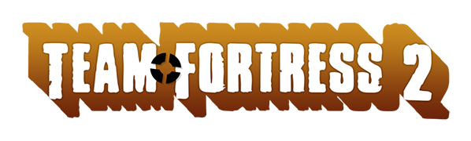

# **Data Lovers**

  

## **Índice**

  

*  [Contexto](#contexto)

*  [Descripción de usuario](#descripcion-de-usuario)

*  [Desarrollo y decisiones de diseño](#desarrollo-y-decisiones-de-diseno)

  
  
  

***

  

## **1. Contexto**

  

**Steam** es una plataforma de distribución digital de videojuegos desarrollada por Valve Corporation. Fue lanzada en Septiembre del 2003 como una forma para Valve de proveer actualizaciones automáticas a sus juegos, pero eventualmente se expandió para incluir juegos que no son de Valve de distribuidores third-party. Steam ofrece gestión digital de derechos, servidores de emparejamiento, transmisiones de vídeo y servicios de redes sociales. También provee al usuario con la instalación y actualización automática de juegos y características de comunidad tales como grupos y listas de amigos, guardado en la nube, voz en el juego y funcionalidad de chat. (Fuente: [Wikipedia](https://es.wikipedia.org/wiki/Steam))

  

**Team Fortress 2 *(TF2)*** es un videojuego multijugador de disparos en primera persona desarrollado y publicado por Valve Corporation. (Fuente: [Wikipedia](https://es.wikipedia.org/wiki/Team_Fortress_2))

  

Descripción en Steam:

  

> Nueve clases diferentes ofrecen una amplia variedad de habilidades tácticas y personalidades. Constantemente actualizado con nuevos modos de juego, mapas, equipamiento y, lo que es más importante, ¡sombreros!

  

Según estadísticas de Steam, en la actualidad existen más de 43.000 jugadores de TF2 y se encuentra en el lugar número 11 de clasificación por número de jugadores.

  

 

  
  

### Problemática y objetivos

  

Uno de los mayores problemas al querer buscar noticias con respecto a un juego, es el de estar visitando distintas páginas para obtener información. Nuestro portal de ***Novedades TF2*** proporciona toda la información filtrada por los blog de noticias más importantes de videojuegos + un acercamiento a la plataforma contenedora del juego, ***Steam***.

  

## **2. Descripción de usuario**

  

### **2.1 Usuario Objetivo**

  

_Steam_, al ser una plataforma tan conocida en el mundo de los videojuegos, tiene una cantidad enorme de usuarios que la utilizan a diario y nos fijamos que la _data_ que teníamos disponible para trabajar, contenía noticias de un mismo videojuego: _Team Fortress 2_. Debido a lo anterior y al hecho de que ambas conocíamos la plataforma por ser jugadoras, fuimos capaces de definir rápidamente un usuario objetivo.

  

Nuestros usuarios son:

Personas que juegen o hayan jugado el videojuego _"Team Fortress 2"_ en su versión para computador, con una rango etario entre los 20 y 30 años.

  

#### **2.2 Primeras Entrevistas**

  

En una primera instancia, decidimos hacer una pequeña entrevista, para definir los intereses de nuestros usuarios con respecto al proyecto.

*_Algunas Preguntas fueron modificadas según lo que respondía el usuario_*

\* 1er usuario; Hombre, 23 años.

¿cómo llegaste a jugar 'TF2'?

- Me lo Recomendó un amigo hace años, en el colegio.

¿Por qué lo dejaste de Jugar?

- Porque perdía mucho y me frustraba, Aparte se me hechó a perder el PC en ese tiempo, así que tampoco lo podía jugar.

¿Usabas la Plataforma _Steam_ con regularidad?

- sí, desde que comencé a jugar.

¿Y leias las noticias sobre el juego?

- No, porque no sabía que había noticias sobre ese juego. Pero, me informo arto sobre otros juegos de rockstar games, cómo el GTA...

Si entras a una pagina que informa sobre un juego, ¿que te gustaría leer?

- Bueno, a mí al menos, lo que más me gusta es saber sobre el contenido que se irá añadiendo, o que podrá mejorar el juego con alguna actuaización.

  

\* 2do Usuario; mujer 26 años.

¿cómo llegaste a jugar 'TF2'?

- Una amiga lo jugaba

¿Que te llama la atención del juego?

- era gratis.

¿Usas Steam con regularidad?

- No, antes sí.

¿haz leído noticias de Video Juegos?

- Sí.

¿Que peinsas de ellas?

- Innecesarias

Si entras a una pagina que informa sobre un juego, ¿que te gustaría leer?

- Noticias sobre eventos, porque me gusta participar de ellos.

  

\* 3er Usuario: mujer, 20 años.

¿Hace cuanto juegas 'TF2'?

- A pesar de todos los años que tiene, nunca me enteré de que existía el juego, así que empece a jugarlo como hace un año.

¿Cómo llegaste a jugar 'TF2'?

- Una amiga me lo recomendó, porque dijo que se parecia al Overwatch pero gratis.

¿que te llama la atención del juego?

- El diseño de los personajes, es lo que más me gusta. Los mapas igual son buenos, pero cada personaje es único.

¿Usas la Plataforma de Steam de forma habitual?

- Sí la uso habitualmente.

¿Lees noticias sobre el TF2?

- Sí me gusta mantenerme al tanto de lo que pasa en el juego. O también las actualizaciones, aunque sean pocas.

  

\* 4to Usuario: Hombre, 28 años

¿Cuanto tiempo jugaste TF2?

- como 100 - 120 horas.

¿como llegaste a jugar TF2?

- Era _Gamer_ pobre. Busqué en Steam 'Free To Play' y me salió el TF2

¿Que es lo que te llama más la atención del juego?

- Lo enfermo que era, es muy bizarro y son muy chistoso los match.

¿Usas la plataforma de Steam de forma habitual?

- Sí, con mi cuenta actual. Me conecto todos los días para actualizar lod juegos o ver alguna oferta.

¿Lees noticias sobre el TF2 en Steam?

- Sí, leí la ultima, sobre el aniversario 12 del juego y que aún se seguía actualizando.

¿Cúales son las que más te interesan?

- Las de actualización. Yo que estoy estudiando algo ligado al medio te puedo decir queme sorprende un juego que tenga mas de 10 años y no lo dejen tirado. Es el compromiso de _valve_ como desarrollador...

  

\* 5to usuario: Hombre, 30 años.

¿Hace cuanto juegas el TF2?

- 10 años

¿Cómo llegaste a jugar el TF2?

- A travez de Steam. Buscabamos juegos colaborativos y en equipo, no tan realistas, tipo animación, así lo encontramos.

¿qué es lo que más te llama la atención?

- Las modalidades de juegos , por ejemplo: casual, competitivo, capturar a bandera, carga explosiva y otros más. Te da la oportunidad de jugar contra otros players o cómo con la maquina; Mann vs Machine. Lo mejor es que los micropagos que tiene no son para ganar nivel o tener mayor skill, es simplemente Skins.

¿usas la plataforma de steam de forma habitual?

- sí, se inicia con el pc.

¿Lees noticias sobre el TF2?

- solo las que aparecen en el inicio o si sale algun modo nuevo. Cosas como mantenimiento o mejoras en actualizaciones no, esas me las pillo en el juego solamente.

### **2.3 Test de usuario**

Hicimos 2 testeos con prototipos de alta fidelidad, para poder analizar y rediseñar nuestra página con respecto al feedback entregado.

Se pueden ver los videos en estos enlaces:

- [Video 1]()
- [Video 2]()

### **2.4 Historias de usuario**

  

En base a nuestras entrevistas y primeros testeos de usuario, hicimos 3 historias de usuario que irían en función de responder sus requerimientos.

  

#### **Historia 1**

  

> Yo como persona apasionada a los videojuegos quiero acceder de una manera más sencilla a la información dependiendo de mis intereses en el juego.

  

#### **Historia 2**

  

> Yo como jugador asiduo quiero ver primero si hay eventos o actualizaciones nuevas para poder participar activamente tanto del juego como de la comunidad.

  

#### **Historia 3**

  

> Yo como persona apasionada a los videojuegos quiero saber cada cuánto hay actualizaciones y mejoras del TF2 para poder darme cuenta si el juego aún está vigente.

### **2.4 Criterios de aceptación y requerimientos**

- Mostrar filtro de noticias según actualizaciones 
- Opción de poder ordenar por fecha
- Destacar noticia más reciente
- Mostrar información relevante a actualizaciones y mejoras
  
  

  

## **3. Desarrollo y decisiones de diseño**

### **3.1 Paleta de colores, tipografía y diseño**

  

La paleta de colores que quisimos utilizar, contiene parte de la paleta de colores tanto de _Steam_ como de _TF2_. Nuestra idea era hacer una paleta reconocible por los usuarios, para que se pudiera entender que las noticias que están viendo son de _Steam_ pero pertenecen a un juego en específico.

  

 

  

Con respecto a la tipografía, preferimos usar sólo 2 fuentes, para no sobrecargar el diseño. Ambas **Sans Serif** de _Google Fonts_ y que van bien juntas:

-  **Poller One:** Más lúdica, sólo para el título.

-  **Roboto (Regular y Bold):** Legible, con 2 pesos, _Regular_ para contenido general y _Bold_ para dar énfasis en títulos de noticias, enlaces y botones.

  

Desde el primer prototipo, estuvo pensado su diseño responsive, pero por un tema de tiempo, hicimos el diseño en el siguiente prototipo con feedback incluido.

  

  

### **3.2 Diagrama de flujo y prototipo de baja fidelidad**

  

El diagrama de flujo fue lo primero que hicimos ya que queríamos tener una idea sobre qué preguntar y nos ayudó a guiar las entrevistas.

  

  

Posterior a las entrevistas, hicimos un prototipo de baja fidelidad para ordenar un poco las vistas y la estructura de nuestra página. Este prototipo fue simple:

  

  

### **3.3 Prototipo de alta fidelidad: Inicial**

  

El primer prototipo tenía la información que habíamos recabado de nuestras entrevistas iniciales. Al ser un prototipo más básico en cuando a funcionalidad, necesitábamos los testeos de usuario para poder mejorar la propuesta.

  

Este primer prototipo se puede ver en el siguiente enlace de [Figma](https://www.figma.com/file/GrrxmIWLWE2uAhYsJAEtbM/Untitled?node-id=0%3A1)

  
### **3.4 Prototipo de alta fidelidad: Feedback**

  

Luego del feedback recibido por los testeos, rediseñamos nuestro primer prototipo. En esta parte del proceso, tuvimos en consideración el diseño mobile, que pueden ver en este enlace de [Figma](https://www.figma.com/file/GrrxmIWLWE2uAhYsJAEtbM/Untitled?node-id=84%3A0). Como siempre tuvimos en mente el diseño mobile, no hubo problemas al ordenar la información en su versión responsive.